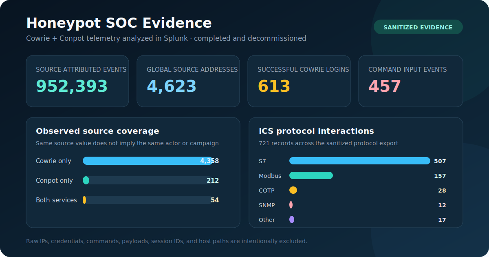
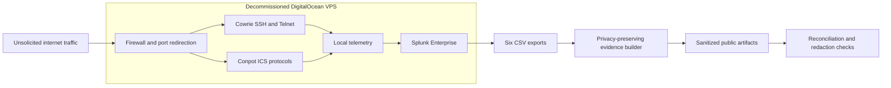

# Honeypot SIEM Case Study

[](https://github.com/PeteAndrews1289/honeypot-siem-project/actions/workflows/validate-evidence.yml)

> **Status: completed and decommissioned.** The VPS and associated services were destroyed after collection. This repository contains a sanitized retrospective case study; raw telemetry is intentionally excluded.

This project deployed Cowrie and Conpot on an isolated DigitalOcean VPS, ingested the resulting SSH, Telnet, and ICS/SCADA telemetry into Splunk, and turned the exports into a privacy-preserving, testable evidence package.



## Results at a Glance

| Result | Verified value | Definition |
|---|---:|---|
| Source-attributed event records | **952,393** | Sum of `total_events` in the aggregate source export; events without an extracted source are outside this denominator |
| Distinct observed source values | **4,624** | 4,623 globally routable addresses plus one loopback artifact with two events |
| Cowrie only / Conpot only / both | **4,358 / 212 / 54** sources | “Both” means the same observed source address appeared in both service datasets; it does not establish actor identity or campaign linkage |
| Successful Cowrie authentication events | **613** | Records containing `cowrie.login.success` |
| Cowrie command-input events | **457** | `cowrie.command.input`; 433 occurrences contained a non-empty emulated command |
| ICS-protocol interaction records | **721** | 507 S7, 157 Modbus, 28 COTP, 12 SNMP, and 17 other records |

The [sanitized evidence package](artifacts/evidence/README.md) includes pseudonymized source-level data, reconciled aggregate tables, source-file hashes, UTC windows where available, generation code, tests, and automated privacy checks.

## Architecture and Evidence Flow



The lab deliberately combined a high-volume credential-facing honeypot with lower-volume industrial-protocol emulation. Splunk provided search, field extraction, time analysis, and dashboarding. The public evidence builder then removed source IPs, credentials, raw commands, payload indicators, session identifiers, and host paths before producing the artifacts in this repository.

## Findings

### Activity was concentrated

The median source produced 18 event records, while the largest source produced 17.3% of all source-attributed records. The top ten sources produced 52.9%. This skew shows why raw event totals alone are a weak measure of distinct activity.

### Cowrie produced most source-attributed volume

- 4,358 source values appeared only in Cowrie data and accounted for 949,972 events.
- 212 appeared only in Conpot data and accounted for 1,104 events.
- 54 appeared in both service datasets and accounted for 1,317 combined events.

The overlap is an observable source-address relationship, not proof that one actor or campaign controlled the activity.

### Successful logins produced post-authentication behavior

The high-signal export contains 613 successful Cowrie authentication events and 457 command-input occurrences. Of the command occurrences, 433 were non-empty. Host and network discovery dominated the categorized activity. Twelve occurrences contained a payload-transfer utility; these are observed retrieval attempts inside Cowrie’s emulated environment, not proof of successful malware execution or host compromise.

### Conpot recorded several protocol families

The ICS export contains 721 interaction records: 507 S7, 157 Modbus, 28 COTP, 12 SNMP, and 17 other records. These demonstrate protocol-specific scanning and interaction. They do not establish attacker intent, identity, or successful exploitation.

See [findings-summary.md](artifacts/findings-summary.md) for the evidence-to-claim mapping and [sample-queries.md](artifacts/sample-queries.md) for the SPL used to derive the analysis.

## Data Scope and Limitations

The six source exports came from different Splunk searches and windows:

- The source summary supports aggregate source and event totals but contains no time field.
- The high-signal export spans 2026-04-02 16:05:15.650 UTC through 2026-04-23 13:10:58 UTC.
- The ICS export spans 2026-04-02 16:05:15.650 UTC through 2026-04-22 23:26:36.931 UTC.
- The file originally named `master_dataset.csv` is a capped 10,000-row recent-event sample covering only 2026-04-23 03:29:50 UTC through 14:11:21.649 UTC. It must not be treated as the full corpus.

Additional limitations:

- A source IP is not equivalent to a person, organization, or campaign.
- IP geolocation is approximate; no country-level claims are included because the retained exports do not contain a country aggregate.
- The project ran Splunk on the same public VPS, which simplified the lab but is not the recommended production architecture.
- The retained documentation does not fully prove outbound filtering or management-plane separation. A future design should isolate collection, analysis, and administration.

## Reproducible Public Evidence

Raw exports remain private. To rebuild the public evidence locally:

```bash
python3 scripts/build_evidence.py \
  --input-dir /path/to/private/exports \
  --output-dir artifacts/evidence

python3 scripts/validate_public_evidence.py artifacts/evidence
python3 -m unittest discover -s tests -v
```

The validation workflow checks that:

- 4,624 pseudonymous source rows reconcile to 952,393 source-attributed events.
- All 54 cross-targeting rows are a consistent subset of the source summary.
- Command, ICS, and high-signal category totals reconcile to their exports.
- Public CSV/JSON artifacts contain no raw IPs, URLs, UUIDs, host paths, or sensitive column names.

## Repository Map

- [`artifacts/evidence/`](artifacts/evidence/) — sanitized data, manifest, hashes, and metric definitions.
- [`scripts/`](scripts/) — dependency-free evidence generation and validation tools.
- [`tests/`](tests/) — synthetic tests for aggregation and redaction behavior.
- [`artifacts/`](artifacts/) — findings and query index.
- [`dashboards/`](dashboards/) — dashboard design and Splunk searches.
- [`docs/`](docs/) — phased deployment and analysis retrospective.
- [`configs/`](configs/) — retained deployment and exposure notes.

## Tools and Skills Demonstrated

Cowrie · Conpot · Splunk Enterprise · SPL · Linux · DigitalOcean · Python · privacy-preserving data release · evidence validation · security analysis

This case study is relevant to SOC analysis, detection engineering, threat hunting, and security engineering because it shows the full path from controlled telemetry collection through SIEM investigation, defensible findings, sanitized evidence publication, and automated validation.
