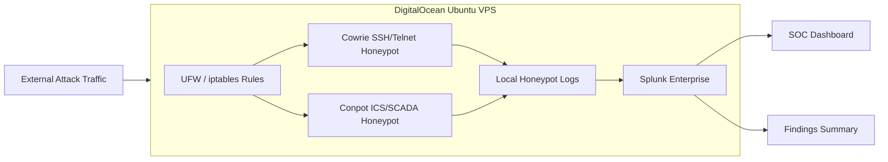

# Honeypot SIEM Project

## Overview

This project documents the deployment of an internet-facing honeypot environment on a DigitalOcean VPS and the analysis of attacker activity in Splunk Enterprise. It addresses a practical security operations problem: defenders need safe ways to observe real external attack behavior, collect useful telemetry, and turn noisy raw events into findings that support detection and response work.

The lab combines Cowrie for SSH/Telnet emulation, Conpot for ICS/SCADA protocol simulation, Ubuntu hardening, firewall controls, and Splunk for log ingestion, searching, enrichment, and dashboarding. The project captured real attacker traffic, including brute-force attempts, successful weak-credential logins, reconnaissance commands, and infrastructure-oriented probing.

The final system demonstrates a lightweight SOC-style workflow: deploy monitored deception services, ingest logs, enrich and search attacker activity, build dashboards, and summarize findings in a way that is useful for security analysts and hiring managers reviewing hands-on work.

## Key Features

- Deployed a public honeypot environment on a DigitalOcean VPS.
- Configured Cowrie to emulate SSH and Telnet services.
- Configured Conpot to simulate ICS/SCADA-style services.
- Hardened the VPS using firewall and service-exposure controls.
- Ingested honeypot logs into Splunk Enterprise.
- Built a dashboard to monitor event distribution, attacker IPs, login outcomes, commands, timelines, and global attack sources.
- Captured real brute-force attempts, successful weak-credential logins, and post-authentication commands.
- Compared high-volume SSH activity against lower-volume ICS/SCADA probing.
- Documented phased setup notes, dashboard logic, firewall rules, and findings.

## Architecture

The environment places Cowrie and Conpot on a public VPS so they can receive controlled external traffic. Honeypot logs are collected locally and ingested into Splunk. Splunk searches and dashboards are then used to analyze attacker behavior, source IPs, successful logins, command execution, and protocol-specific activity.

## Tools & Technologies

### Cloud / Infrastructure

- DigitalOcean VPS
- Ubuntu Linux
- Public internet-facing lab host

### Security Tools

- Cowrie
- Conpot
- Splunk Enterprise
- Nmap

### Programming / Scripting

- Linux shell commands
- Splunk SPL searches
- Service configuration notes

### Monitoring / Logging

- Cowrie SSH/Telnet logs
- Conpot ICS/SCADA logs
- Splunk dashboards
- Geolocation enrichment

### Automation / CI/CD

- No CI/CD pipeline is included in this lab

## Security Concepts Demonstrated

This project demonstrates honeypot deployment, deception technology, SIEM integration, threat analysis, attacker behavior analysis, and SOC dashboarding. It also shows the difference between high-volume opportunistic attacks against common IT services and lower-volume infrastructure or ICS-oriented probing.

The Cowrie portion highlights brute-force behavior, weak credential abuse, successful logins, and post-authentication reconnaissance. The Conpot portion highlights ICS/SCADA protocol probing and malformed or incomplete requests that are useful for recognizing broad scanning campaigns.

The Splunk portion demonstrates how raw honeypot telemetry can be turned into analyst-friendly views for activity volume, top attackers, login outcomes, attacker commands, timelines, and geographic distribution.

## Implementation Steps

1. Planned the honeypot environment and exposure boundaries.
2. Provisioned and hardened an Ubuntu VPS on DigitalOcean.
3. Configured firewall rules with UFW and iptables.
4. Deployed Cowrie for SSH and Telnet honeypot coverage.
5. Deployed Conpot for ICS/SCADA protocol simulation.
6. Configured log collection for honeypot activity.
7. Installed and configured Splunk Enterprise.
8. Ingested Cowrie and Conpot logs into Splunk.
9. Built searches for attacker IPs, successful logins, failed logins, commands, and timelines.
10. Built a dashboard to present honeypot activity like a lightweight SOC console.
11. Summarized findings and attacker behavior patterns.

## Results / Findings

The environment captured activity from 4,624 unique external IP addresses. Cowrie generated the majority of the attack volume, with roughly 950,000 SSH/Telnet-related events. Conpot generated lower-volume but more specialized infrastructure-style probing, including S7, Modbus, and SNMP interactions.

The Cowrie honeypot recorded 613 successful logins using weak/default credentials and 457 attacker-issued commands after authentication. Observed behavior included system reconnaissance, process inspection, and payload delivery attempts using tools such as `wget`, `curl`, `tftp`, and `ftpget`.

The Conpot activity primarily reflected reconnaissance, malformed protocol traffic, and protocol fingerprinting rather than deep exploitation. The project also identified 54 attacker IPs that interacted with both SSH and ICS services, showing that some scanning campaigns probe multiple service categories.

## Screenshots

Existing visual artifact:

- `Honeypot SOC Dashboard Copy.pdf`

Suggested screenshots to add:

- `screenshots/splunk-dashboard-overview.png`
- `screenshots/top-attacking-ips.png`
- `screenshots/successful-logins.png`
- `screenshots/attacker-commands.png`
- `screenshots/global-attack-map.png`
- `screenshots/cowrie-service-status.png`
- `screenshots/conpot-service-status.png`
- `screenshots/architecture.png`

## Challenges & Lessons Learned

- Public honeypots receive high-volume automated traffic quickly after exposure.
- Weak credentials generate useful attacker behavior for analysis, but the environment must be isolated and controlled.
- Cowrie produced much higher event volume, while Conpot produced lower-volume but more specialized protocol signals.
- Dashboard design matters because raw honeypot logs are noisy and need analyst-friendly grouping.
- Comparing IT and ICS-oriented traffic provides useful context about broad attacker scanning behavior.

## Relevance to Security Roles

This project maps well to SOC Analyst, Threat Intelligence Analyst, Detection Engineer, and Security Engineer roles. It demonstrates real attacker telemetry collection, SIEM analysis, dashboarding, finding development, and the ability to communicate observed behavior clearly.

It also supports incident response and threat hunting conversations because it shows how to move from raw logs to attacker behavior patterns and investigation questions.

## Future Improvements

- Add sanitized sample logs from Cowrie and Conpot.
- Add exported Splunk dashboard XML or JSON.
- Add SPL query files for key dashboard panels.
- Add a short findings report with screenshots and timeline analysis.
- Add alerting for successful logins, repeated attacker IPs, and suspicious command execution.
- Add stronger isolation documentation for running public honeypots safely.
- Add enrichment for ASN, country, and known scanner classification.
